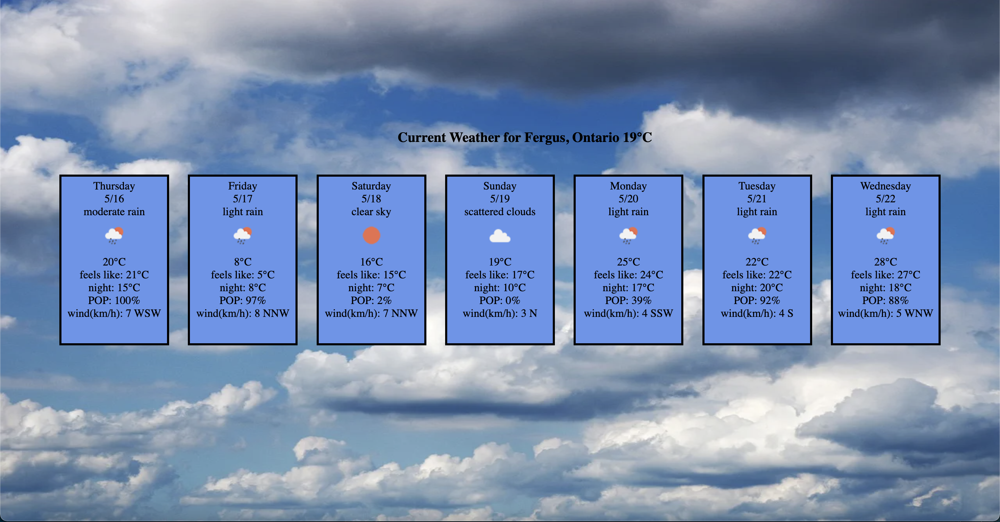

Weather App for Fergus, ON

## Setup
1. Install dependencies with `npm install`
2. Create .env file based on .env.example
3. Get API_KEY from <https://openweathermap.org/api>, One Call API 1.0
4. Put API_KEY into appropriate .env vars
5. Run `npm start` on the folder to start application 
7. Visit `http://localhost:3000/`

## Dependencies
- moment
- React
- axios
- degrees-to-direction
- dotenv

